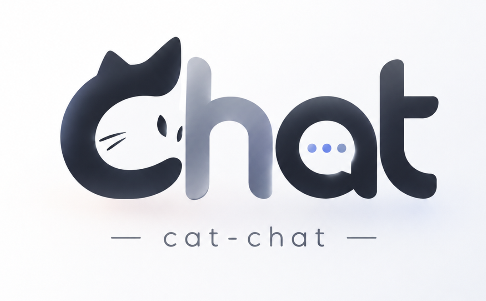

# Cat Chat 2.7.7 Beta

<p align="center">
  
</p>

Cat Chat 是运行在 Windows 本机的通用 AI 自动化工作台。它把在线或本地模型、内置工具、后台任务、Skill、MCP、视觉工具和文件产物统一到一个对话界面中。2.7.7 Beta 把子 Agent 拆成「继承历史」与「干净上下文」两个互斥工具，模式由你选、模型不再自己猜。

> Cat Chat 原名 Naiba Chat。显示名自 2.7.6 Beta 起为 Cat Chat；GitHub 仓库、`naiba-chat.exe`、更新资产及既有数据位置保持不变，无需重新配置或搬迁数据。

## 2.7.7 Beta 主要能力

- **子 Agent 分成两个互斥工具，模式由你选（本次新能力）**：`subagent` 继承本会话完整历史，适合「背景已经在对话里聊清楚了，让子 Agent 接着干」；`subagent_spawn` 不带任何会话历史、只看自身人设与 `instruction`，适合「让子 Agent 从零独立完成一件自包含的事」。两个工具参数完全一致（`instruction` / `allowed_tools` / `label`），在 Agent 工具勾选里**互斥**：勾上一个会自动取消另一个并给出提示。
- **模型不再自己猜模式**：实测中「要不要继承历史」这个判断不可靠——模型既不清楚你聊过什么才算背景，也无法预判继承带来的输入体量，同一句指令在不同运行里可能选到不同模式。因此 `fork` 改为**注册时固化的常量**，模型即使硬塞 `fork` 参数也一律忽略；模式选择权 100% 归用户的工具集，模型侧看不到没启用的那个。
- **互斥归一只有一个权威出口**：`session.normalize_tool_mutex`——组内保留排前者（`subagent` / fork 这一侧）。三个入口全部覆盖：每轮解析可用工具、会话工具集固化落库前、运行中启用额外工具；工具集写入前另有一次归一兜底。前端镜像同一套规则——单点勾选听用户的，批量「全选」按组内优先者归一并提示（副作用：「任务与扩展」分组永远进不了全选态，这是互斥的必然结果）。
- **预设与提示同步**：`full` 预设走分组展开，必须显式排除 `subagent_spawn`；系统常驻提示只讲当前启用的那一个工具的成本特征（继承历史在缓存命中的供应商上按缓存价重放、无缓存中继上是全价重放；干净上下文任何供应商下起步成本都低但看不到前文），两条不会同时出现。
- **验证**：全量单测 **1573 例通过**（新增子代理双工具守门 27 例 + 互斥归一 24 例）；另有三条独立链路实证——前端纯函数冒烟 13 项、隔离真实实例接口探针 11 项（含通过 `/api/tool_sets` 同时写入两个工具、读回只剩 fork）、真实后端浏览器冒烟 12 项。

> 各版本说明与历史更新日志见 [CHANGELOG.md](CHANGELOG.md)。

## 开始使用

### 使用 Windows 版本

1. 下载 `naiba-chat-2.7.7-beta-windows-x64.zip`。
2. 解压到一个可写目录。
3. 运行 `naiba-chat.exe`。
4. 在设置中添加在线 API 或本地模型服务。

首次运行会创建本地数据目录。升级时请直接替换程序文件，不要删除原有 `data` 目录和配置文件。

### 从源码运行

需要 Windows、Python 3.11 或更高版本。

```powershell
git clone https://github.com/yc883123/naiba-chat.git
Set-Location naiba-chat
python -m pip install pywebview pystray pillow "mcp==2.1.1" pymupdf "av==18.1.0" python-multipart
python server.py
```

服务默认地址为 `http://127.0.0.1:8765`。

## 模型配置

在“设置 → 模型”中添加供应商，填写：

- API 地址
- API Key（本地服务通常可以留空）
- 模型名称
- 请求格式
- 是否支持图片输入
- 上下文长度和生成参数

本地模型建议先使用界面中的连接测试确认模型目录、文本推理和图片能力。模型是否能稳定执行工具，仍取决于模型自身的工具调用能力和上下文能力。

## ComfyUI 与 MCP

Cat Chat 默认连接：

```text
ComfyUI HTTP API:  http://127.0.0.1:8188
```

使用前请确保 ComfyUI 已启动，并且目标节点、模型和素材在 ComfyUI 中可用。

当前内置流程接收 ComfyUI **API 工作流**。前端保存的 UI JSON（通常包含 `nodes` 和 `links`）不能直接提交，需要先在 ComfyUI 中导出 API 格式。

任务提交后由宿主完成以下工作：

1. 校验并规范化工作流参数。
2. 向 `/prompt` 提交任务。
3. 轮询任务历史和执行状态。
4. 自动收集图片、视频或音频产物，缓存到受管理数据目录并生成缩略图。
5. 附加到最终消息（中止/取消的轮次也会展示已生成的产物）。
6. 在聊天界面提供预览或下载。

推荐的工作流修改方式：对已有工作流文件，用 `read_file`/`comfyui_prepare_workflow` 读取结构，用 `edit_file` 做局部精确替换（改提示词/seed/尺寸等），再用 `comfyui_batch` 的 `workflow_paths` 提交文件路径；不要整段内联大工作流 JSON。

这条链路不要求模型读取产物本身。需要评价画面、OCR、定位对象或比较图片时，用户应明确提出分析要求；用户明确要求「保存/复制到指定目录」时模型会实际执行。

### MCP 说明

- 应用启动时自动连接所有已启用的 MCP 服务，并对启动时未连上的服务做周期重试。
- MCP 工具以 `mcp__<server>__<tool>` 形式注册进当前会话的可用工具集；会话工具集在首条消息时固化。
- `call_mcp(server, tool, arguments)` 只能调用**当前会话可用集内**的 MCP 工具；若目标工具不在可用集内，会提示用户重开会话、在 Agent 工具勾选里加上该 MCP 服务后再用。
- `register_mcp` 只是把服务登记进配置，其工具会在**重开会话后**进入新会话的可用集，本会话内不会因注册而新增可用工具。

## 工具、Skill 与 MCP 的关系

- **内置工具**：由当前任务意图直接触发，例如文件操作、命令执行、后台任务、ComfyUI 和视觉处理。
- **Skill**：提供特定领域的说明、模板、脚本和检查清单，不决定工具是否可用。
- **MCP**：接入外部工具服务；只有任务明确需要对应 MCP 服务时才会连接或调用。

因此，生成图片不需要先启动短剧 Skill，普通编程、资料整理、自动化处理和媒体任务也使用同一套运行机制。

## 数据与安全

- 对话、设置、附件和任务状态保存在本地数据目录。
- 缓存文件（用户上传与宿主产物的图片/PDF/视频/音频等）统一存于受管数据目录（用户上传 `data/uploads`、生成产物 `data/generated`），设置页可查看合计大小、按时间清理旧缓存（清理为手动操作，会按时间从旧到新删除最旧文件、不区分是否被引用）并配置自动清理阈值（默认 256MB，自动清理只删未被消息引用的最旧文件）。
- API Key 不应提交到 Git；示例配置不包含真实凭据。
- 局域网访问需要访问口令，默认仅本机访问时不要求口令。
- 文件预览只允许应用工作区和受管理数据目录（`data/uploads`、`data/generated`）中的文件。
- 高风险写入、删除、外部发布和凭据操作仍受权限策略保护。

## 自动更新校验

发布资产包含：

- `naiba-chat.exe`
- `naiba-chat-update.json`
- `naiba-chat-2.7.7-beta-windows-x64.zip`

更新器会验证清单中的仓库、提交、文件名和 SHA-256。下载文件还必须是有效的 Windows 可执行文件；任何一项不一致都会终止安装。

## Beta 说明

这是 2.7.7 Beta，适合实际使用和反馈，但仍有以下边界：

- 不内置 ComfyUI、模型权重或第三方生成服务，需用户自行安装和配置。
- 不同模型的工具调用质量差异较大，小型模型可能无法稳定完成长链任务。
- ComfyUI 自定义节点和工作流输入差异很大，复杂模板仍可能需要一次参数适配。
- 自动化任务应在交付前检查最终文件；涉及发布、删除或覆盖的重要操作应保留备份。
- MCP 工具仅在重开会话后才会进入会话可用集；若模型发现 MCP 服务存在但其工具不在当前会话可用范围，会提示用户重开会话。
- 视频抽帧依赖 PyAV（打包版已内置随附的 FFmpeg 运行库）；从源码运行时需要 `pip install av`，缺失时工具会明确提示安装而不是直接崩溃。

## 测试与构建

```powershell
Get-ChildItem public\js\*.js | ForEach-Object { node --check $_.FullName }
python -m unittest discover -s tests -q
$env:NAIBA_BUILD_VERSION = "2.7.7-beta"
python -m PyInstaller --noconfirm --clean naiba-chat.spec
```

静态检查器、浏览器冒烟与数据播种脚本**随仓库发布**在 `verify/`（完整清单与用法见 `项目维护说明（修改代码前必读）.md` §六）：

```powershell
python verify\scan_undef_all.py        # 未定义名扫描（Python 全包）
python verify\esm_graph_check.py       # 前端 ESM 导入/导出图一致性
python verify\tdz_check.py             # 前端顶层求值序（TDZ）候选
node verify\media_markup_check.mjs     # 媒体渲染（无浏览器）
$env:NODE_PATH="%USERPROFILE%\node_modules"
node verify\browser_smoke.cjs          # 浏览器冒烟（需 playwright + Edge）
python verify\ring_usage_smoke.py      # 上下文圆环/提醒端到端冒烟（自编排）
```

浏览器冒烟需要本机 `npm install playwright` 并已安装 Edge；脚本一律用相对项目根的路径，换机器无需改代码。

## 项目地址

- GitHub：<https://github.com/yc883123/naiba-chat>
- Issues：<https://github.com/yc883123/naiba-chat/issues>

