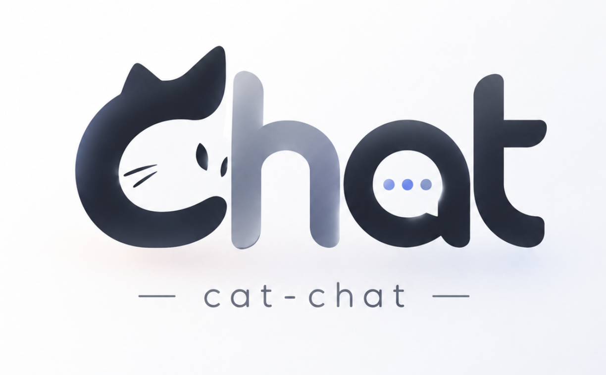

# Cat Chat 2.9.7 Beta

<p align="center">
  
</p>

Cat Chat 是运行在 Windows 本机的通用 AI 自动化工作台。它把在线或本地模型、内置工具、后台任务、Skill、MCP、视觉工具和文件产物统一到一个对话界面中。2.9.7 Beta 解决的是「上传明明传完了，却要干等几十秒」——根因是每次上传都在请求里**同步**跑一遍缓存清理（实测一轮判定 58 秒）。本版把清理挪到后台，并把**用户上传缓存与生成产物缓存彻底分开、各删各的**：各有各的阈值、各有各的清理按钮与触发点。注意一条语义变化——`auto_clean_limit_mb` 从「两目录合计」收窄为「只管上传缓存」。

> Cat Chat 原名 Naiba Chat。显示名自 2.7.6 Beta 起为 Cat Chat；GitHub 仓库自 2.8.0 Beta 起更名为 `cat-chat`（旧地址自动跳转）。更新资产仍使用 `naiba-chat.exe` 与原有清单协议，既有数据位置不变，无需重新配置或搬迁数据。

## 2.9.7 Beta 主要能力
- **止痛：上传落盘即返回，自动清理挪到后台（本次重点）**：此前每次上传都会同步跑一遍缓存清理——实测缓存 1053.5MB / 509 组，每组两次 LIKE 全表扫（messages.metadata 共 118MB），一轮判定 58 秒，全部卡在上传请求里（`POST /api/uploads` 返回 200 却耗时 78.6 秒）。现在上传落盘后立即返回，清理在后台线程执行；响应新增 `clean_pending` 字段，**仅表示已登记/启动了清理**，不作为上传变慢的归因。清理进行中再触发会按目录登记、结束后复查补跑，不丢最后一次触发。
- **除根：引用判定从 1018 次全表 LIKE 降到一次流式扫描（本次重点）**：新增批量引用读取——游标流式扫 `messages.metadata` + `background_tasks.snapshot`，用 C 级字符串查找抽取引用路径（不把 118MB 一次性 `json.loads`，峰值内存几 MB），按目录归成规范化 key 集合用于快速保留；集合外、准备删除的每一组，删除前仍再走一次原有 `upload_path_referenced` LIKE 复核，命中即保留——**双保险，误方向只能是「多留」**。
- **uploads 与 generated 彻底分开、各删各的（本次重点）**：以前显示、阈值、清理三层全混——设置页只有一个合计数；一个 `auto_clean_limit_mb` 管两目录合计；清理把两目录放进同一 mtime 池对同一额度删最旧，**generated 撑爆额度时会挤删最旧的用户上传图**；而且 generated 没有自己的触发点，只生成不上传时再大也永不清。现在：**显示拆开**（上传缓存 / 生成产物缓存两个数，合计字段保留）；**阈值拆开**（uploads 用 `auto_clean_limit_mb`，新增 `generated_clean_limit_mb`，新装默认 512MB）；**清理按目录拆开**（每次只扫一个目录、只对自己的阈值）；**触发拆开**（上传只触发 uploads，产物落盘触发 generated）。
- **阈值语义变化（升级须知）**：`auto_clean_limit_mb` 从「uploads + generated 两目录合计」收窄为「**只管 uploads**」。存量配置未显式设置新字段时，`generated_clean_limit_mb` 会**继承原 `auto_clean_limit_mb` 的值（包括 0=关闭）**，避免升级后突然开始删除生成产物；你显式设置过的值不会被覆盖。两个目录各自的 0 都表示关闭该目录的自动清理。
- **不可达判定 + 状态上报（可观测）**：不再用「连续 K 组被引用就停」的近似短路（它会跳过后面的可删文件）；现在先完整扫描候选并归类，再据「剩余候选都不可删」判定 `unreachable`，并新增 `referenced_bytes`（该目录被引用占用的完整字节数）。清理异常记日志并保留可查询的失败状态，**不把失败伪装成完成**。
- **慢上传提醒（前端）**：进度到 100% 但响应未回时，上传 chip 显示「服务器处理中…」，不再把传输完成误显示成上传成功；等待超过 8 秒（计时从 100% 起，响应/取消即清）追加「文件已传到服务器，正在处理，请稍候，暂时不要重复上传」；失败/超时/断网给出重试引导。慢提示**不依赖 `clean_pending`**。
- **设置页提示**：缓存大小旁，若该目录「被引用部分 > 该目录阈值」，显示「其中 X MB 被历史消息引用，自动清理无法释放；需删除对应会话才能腾出」，uploads / generated 各一行。
- **边界与安全（如实说清）**：清理只读 SQLite + 逐文件 `unlink`（沿用既有 OSError 容错），后台线程为 daemon；自动清理与手动按钮共用一把进程内锁，手动清理占锁时返回「正在清理，请稍后再试」，前端不显示误导性完成提示；手动清理接口支持 `{scope}`，不带 scope 时串行清两目录并返回各自结果（兼容旧调用）。**不改数据格式、不改 DB schema**，升级直接覆盖安装即可。
- **验证**：全量单测 **1988 例**通过（新增守门覆盖批量判定与 LIKE 复核一致、提取漏判被删除前复核兜住、scope 隔离、不可达完整扫描、上传不等待、锁互斥与补跑、generated 落盘触发、配置迁移、两阈值独立）；全部新守卫做变异核对，摘掉关键判据逐条判红、还原即绿。另有前端真后端隔离实例的 Playwright 截图（慢上传提示、设置页拆分各一张）。
> 各版本说明与历史更新日志见 [CHANGELOG.md](CHANGELOG.md)。

## 开始使用

### 使用 Windows 版本

1. 下载 `cat-chat-2.9.7-beta-windows-x64.zip`。
2. 解压到一个可写目录。
3. 运行 `cat-chat.exe`。
4. 在设置中添加在线 API 或本地模型服务。

> 归档里也提供旧名 `naiba-chat-2.9.7-beta-windows-x64.zip`（内含 `naiba-chat.exe`）——**两者内容等价，只是包内 exe 的文件名不同**，任选其一即可。安装后的文件名由你首次解压的那个决定，之后自动更新会一直沿用，不会中途改名。

首次运行会创建本地数据目录。升级时请直接替换程序文件，不要删除原有 `data` 目录和配置文件。

### 从源码运行

需要 Windows、Python 3.11 或更高版本。

```powershell
git clone https://github.com/yc883123/cat-chat.git
Set-Location cat-chat
python -m pip install pywebview pystray pillow "mcp==2.1.1" pymupdf "av==18.1.0" python-multipart
python server.py
```

服务默认地址为 `http://127.0.0.1:8765`。

## 模型配置

在“设置 → 模型”中添加供应商，填写：

- API 地址
- API Key（本地服务通常可以留空）
- 模型名称
- 请求格式
- 是否支持图片输入
- 上下文长度和生成参数

本地模型建议先使用界面中的连接测试确认模型目录、文本推理和图片能力。模型是否能稳定执行工具，仍取决于模型自身的工具调用能力和上下文能力。

## ComfyUI 与 MCP

Cat Chat 默认连接：

```text
ComfyUI HTTP API:  http://127.0.0.1:8188
```

使用前请确保 ComfyUI 已启动，并且目标节点、模型和素材在 ComfyUI 中可用。

当前内置流程接收 ComfyUI **API 工作流**。前端保存的 UI JSON（通常包含 `nodes` 和 `links`）不能直接提交，需要先在 ComfyUI 中导出 API 格式。

任务提交后由宿主完成以下工作：

1. 校验并规范化工作流参数。
2. 向 `/prompt` 提交任务。
3. 轮询任务历史和执行状态。
4. 自动收集图片、视频或音频产物，缓存到受管理数据目录并生成缩略图。
5. 附加到最终消息（中止/取消的轮次也会展示已生成的产物）。
6. 在聊天界面提供预览或下载。

推荐的工作流修改方式：对已有工作流文件，用 `read_file`/`comfyui_prepare_workflow` 读取结构，用 `edit_file` 做局部精确替换（改提示词/seed/尺寸等），再用 `comfyui_batch` 的 `workflow_paths` 提交文件路径；不要整段内联大工作流 JSON。

这条链路不要求模型读取产物本身。需要评价画面、OCR、定位对象或比较图片时，用户应明确提出分析要求；用户明确要求「保存/复制到指定目录」时模型会实际执行。

### MCP 说明

- 应用启动时自动连接所有已启用的 MCP 服务，并对启动时未连上的服务做周期重试。
- MCP 工具以 `mcp__<server>__<tool>` 形式注册进当前会话的可用工具集；会话工具集在首条消息时固化。
- `call_mcp(server, tool, arguments)` 只能调用**当前会话可用集内**的 MCP 工具；若目标工具不在可用集内，会提示用户重开会话、在 Agent 工具勾选里加上该 MCP 服务后再用。
- `register_mcp` 只是把服务登记进配置，其工具会在**重开会话后**进入新会话的可用集，本会话内不会因注册而新增可用工具。

## 工具、Skill 与 MCP 的关系

- **内置工具**：由当前任务意图直接触发，例如文件操作、命令执行、后台任务、ComfyUI 和视觉处理。
- **Skill**：提供特定领域的说明、模板、脚本和检查清单，不决定工具是否可用。
- **MCP**：接入外部工具服务；只有任务明确需要对应 MCP 服务时才会连接或调用。

因此，生成图片不需要先启动短剧 Skill，普通编程、资料整理、自动化处理和媒体任务也使用同一套运行机制。

## 数据与安全

- 对话、设置、附件和任务状态保存在本地数据目录。
- 缓存文件（用户上传与宿主产物的图片/PDF/视频/音频等）统一存于受管数据目录（用户上传 `data/uploads`、生成产物 `data/generated`），设置页可**分别**查看两者大小与合计、**按目录**手动清理旧缓存（会按时间从旧到新删除最旧文件，但被消息、快照、聊天背景引用的文件一律保留），并**分别**配置两个自动清理阈值（上传缓存默认 256MB、生成产物缓存默认 512MB；两者各删各的、互不挤占额度）。
- API Key 不应提交到 Git；示例配置不包含真实凭据。
- 局域网访问需要访问口令，默认仅本机访问时不要求口令。
- 文件预览只允许应用工作区和受管理数据目录（`data/uploads`、`data/generated`）中的文件。
- 高风险写入、删除、外部发布和凭据操作仍受权限策略保护。

## 自动更新校验

发布资产包含：

- `naiba-chat.exe` —— **自动更新链路唯一使用的资产，永久保留此文件名**
- `naiba-chat-update.json` —— 更新清单，其中 `repository` 字段永久写 `yc883123/naiba-chat`
- `cat-chat.exe` —— 与 `naiba-chat.exe` 是同一文件，SHA-256 完全相同
- `cat-chat-2.9.7-beta-windows-x64.zip`
- `naiba-chat-2.9.7-beta-windows-x64.zip` —— 与上一个内容等价，仅包内 exe 名不同

更新器会验证清单中的仓库、提交、文件名和 SHA-256。下载文件还必须是有效的 Windows 可执行文件；任何一项不一致都会终止安装。**自动更新始终读取 `naiba-chat.exe` 与清单里的旧仓库名**（GitHub 对旧仓库地址做长期重定向），这是已发布客户端逐字校验的协议，仓库改名后也不改值。

## Beta 说明

这是 2.9.7 Beta，适合实际使用和反馈，但仍有以下边界：

- 不内置 ComfyUI、模型权重或第三方生成服务，需用户自行安装和配置。
- 不同模型的工具调用质量差异较大，小型模型可能无法稳定完成长链任务。
- ComfyUI 自定义节点和工作流输入差异很大，复杂模板仍可能需要一次参数适配。
- 自动化任务应在交付前检查最终文件；涉及发布、删除或覆盖的重要操作应保留备份。
- MCP 工具仅在重开会话后才会进入会话可用集；若模型发现 MCP 服务存在但其工具不在当前会话可用范围，会提示用户重开会话。
- 视频抽帧依赖 PyAV（打包版已内置随附的 FFmpeg 运行库）；从源码运行时需要 `pip install av`，缺失时工具会明确提示安装而不是直接崩溃。

## 测试与构建

```powershell
Get-ChildItem public\js\*.js | ForEach-Object { node --check $_.FullName }
python -m unittest discover -s tests -q
$env:NAIBA_BUILD_VERSION = "2.9.7-beta"
python -m PyInstaller --noconfirm --clean naiba-chat.spec
```

静态检查器、浏览器冒烟与数据播种脚本**随仓库发布**在 `verify/`（完整清单与用法见 `项目维护说明（修改代码前必读）.md` §六）：

```powershell
python verify\scan_undef_all.py        # 未定义名扫描（Python 全包）
python verify\esm_graph_check.py       # 前端 ESM 导入/导出图一致性
python verify\tdz_check.py             # 前端顶层求值序（TDZ）候选
node verify\media_markup_check.mjs     # 媒体渲染（无浏览器）
$env:NODE_PATH="%USERPROFILE%\node_modules"
node verify\browser_smoke.cjs          # 浏览器冒烟（需 playwright + Edge）
python verify\ring_usage_smoke.py      # 上下文圆环/提醒端到端冒烟（自编排）
```

浏览器冒烟需要本机 `npm install playwright` 并已安装 Edge；脚本一律用相对项目根的路径，换机器无需改代码。

## 项目地址

- GitHub：<https://github.com/yc883123/cat-chat>（原名 <https://github.com/yc883123/naiba-chat>，旧地址自动跳转）
- Issues：<https://github.com/yc883123/cat-chat/issues>

