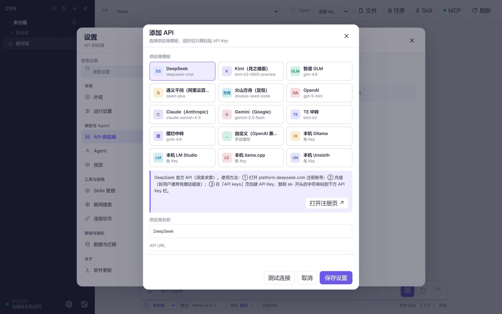
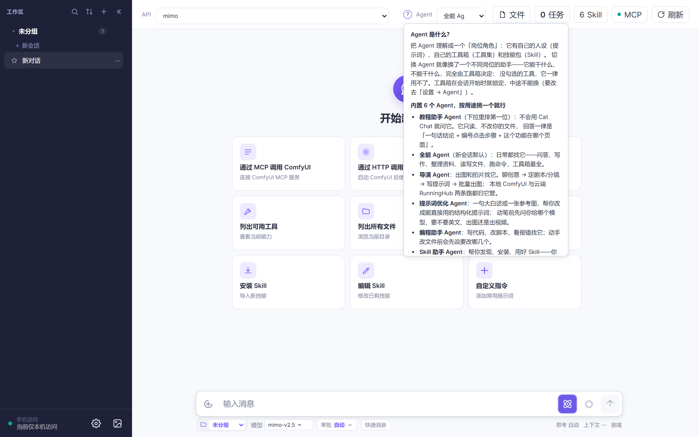
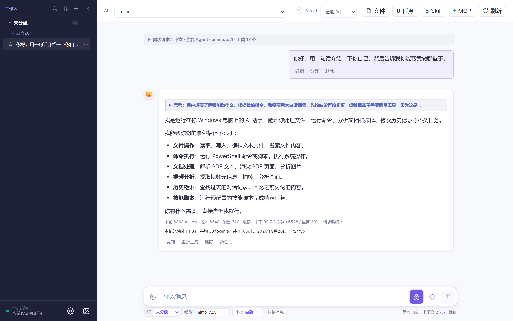
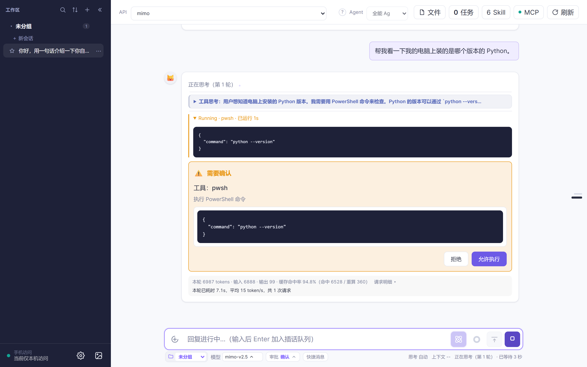
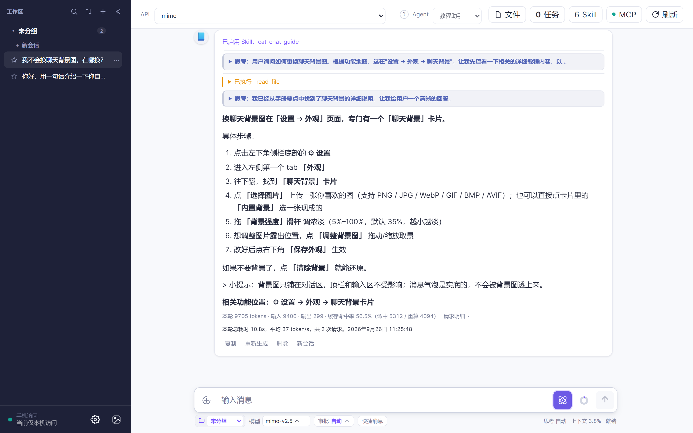

# 3 分钟第一次对话：装好之后先干这三件事（小白版）

> 目标：从「打开软件不知道点哪」到「发出去第一句话、看懂 AI 在干什么」。
> 只需要三件事：**接一个模型**、**确认用哪个 Agent**、**打字回车**。

---

## 第 1 步：接一个模型（第一次使用必做，约 1 分钟）

Cat Chat 自己不带模型——AI 要思考、要调工具，都得先接一个模型服务。**这一步全系列只讲这一次**，后面七篇都默认你已经配好了。

1. 点**左下角侧栏底部的 ⚙ 设置** → 左侧 **「API 供应商」**。
2. 点最后一张 **「添加 API」** 卡 → 顶部点一个**平台预设模板**（DeepSeek、Kimi、智谱、OpenAI、Claude、Gemini……），名称、地址、请求格式会**自动填好，你只需要粘贴 API Key**：



3. 点 **「检查模型」** 拉出这个 Key 能用的模型列表，选一个 → 点 **「测试连接」** 确认通 → 点 **「保存设置」**。
4. 回到主界面，**在底部输入区的「模型」下拉里选中刚加的模型**。

> **新手最常踩的两个坑**
>
> - **顶栏那个下拉是「API」，底部的才是「模型」。** 一个 API 下面可以挂好几个模型（同一个 Key 既有便宜的快模型、也有慢的强模型），选哪个在底部选，**每个会话单独选一次**。
> - **不选模型，消息就发不出去**——发送键会一直是灰的。
>
> Key 到对应平台官网申请。模板里没有你的平台？选「自定义（OpenAI 兼容）」手动填地址与 Key，只要对方文档写着「兼容 OpenAI」就能用。

## 第 2 步：认识顶栏三件事（约 15 秒）

配好模型后，主界面顶栏从左到右就三样东西，你以后每天都会用到：

| 位置 | 是什么 | 什么时候用 |
|---|---|---|
| **顶栏下拉** | 这一轮走哪个 **API** | 换一个服务商 |
| **顶栏「Agent」下拉** | 这一轮**谁当家**（人设 + 工具集） | 换一种干活的角色，**最常用** |
| **顶栏「任务」** | 后台在跑什么 | 批量出图、跑长任务时看进度 |

**Agent 是什么？** 可以理解成「员工岗位」：不同岗位会的事不一样——导演会出图，编程助手会写代码。
下拉右边有个 **`?`** 按钮，点开能看到全部内置 Agent 各自是干嘛的：



> 出厂自带 6 个 Agent，**排在第一位的是「教程助手」**——这个系列每一篇都会提到它。
> 如果你以前用过这个软件，列表里可能还有几个早期留下的自定义 Agent，留着不影响，也可以删掉。

## 第 3 步：说出第一句话（约 40 秒）

新建会话时，**默认用的就是「全能 Agent」**（日常杂事都找它），所以第一次对话不用先切换。

看一眼底部的「模型」下拉确认选好了 → 在输入框打字 → 回车：

```text
你好，用一句话介绍一下你自己，然后告诉我你能帮我做哪些事。
```



它能做的事，取决于**当前 Agent 的工具集**。比如你让它「列出当前文件夹里的文件」，它会真去读目录，再把结果写回来。

## 第 4 步：看懂那个「要你点头」的框（约 30 秒）

只要 AI 要**动你电脑上的东西**（读文件、写文件、跑命令），它会先停下来问你一句：



- 点 **「允许」**，它才真的动手；
- 点「拒绝」，它会换个思路，不会硬来。

**嫌麻烦可以调档**：底部左侧有 **「审批」** 按钮，上拉三档——

| 档位 | 行为 |
|---|---|
| **确认**（默认） | 每次动文件都问你 |
| **自动** | 工作区内的操作放行，越界的才问 |
| **完全** | 一句都不问（**慎用**，建议只用在信得过的任务上） |

> 只是聊天、问答、出图这类不动本地文件的事，不会弹这个框。

## 第 5 步：不会用？问第一位（约 20 秒）

Agent 下拉里**排第一位的是「教程助手 Agent」📘**，它是专门教你用这个软件的。回答固定按「一句话结论 → 编号点击步骤 → 这个功能在哪个页面」来给，按钮名精确到字：



试一句：

```text
我不会换聊天背景图，在哪换？
```

拿不准的按钮名，它宁可说「我先帮你查一下」，也不会编一个不存在的按钮名给你。

---

## 常见问题

**Q：消息发不出去，发送键是灰的？**
A：**没选模型**。去底部状态栏最左的「模型」下拉里选一个，每个会话都要选一次。

**Q：它说「我没有这个工具」？**
A：当前 Agent 的工具集里没有那件工具。换一个更合适的 Agent（比如要出图就找导演 Agent），或者去 **设置 → Agent** → 点开这个 Agent → **工具集** 里勾上。

**Q：想换个模型回答？**
A：底部「模型」下拉随时换，只影响这个会话后面的对话。

**Q：顶栏下拉和底部下拉到底啥区别？**
A：顶栏是**打哪条外线**（API 供应商），底部是**这一单派哪位专家**（具体模型）。一个 API 下面可以有多个模型。

**Q：以前留下的那几个 Agent 能删吗？**
A：能。**设置 → Agent** → 卡片右上角的 ×。出厂自带的 6 个带「内置」徽标——**删不掉，但可以随便改内容**。

---

## 下一步

- 想让 AI 帮你**出图**：看 **教程 2 · 3 分钟用 ComfyUI 出图**
- 没显卡 / 没装 ComfyUI：看 **教程 3 · 3 分钟用 RunningHub 云端出图**
- 想让它**写代码、写小工具**：看 **教程 6 · 3 分钟让 AI 写个小工具**
- 碰到任何不会的：**问 Agent 下拉第一位**
