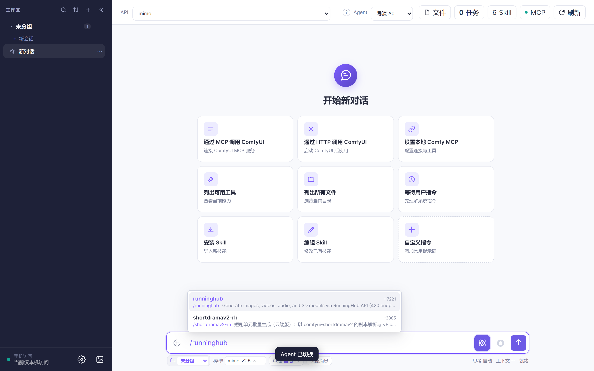
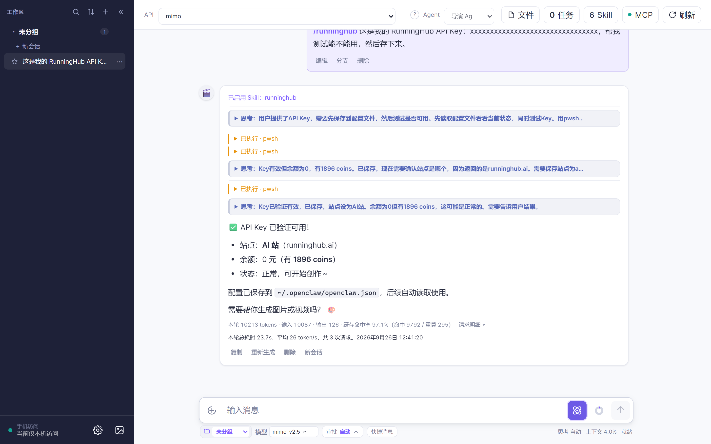
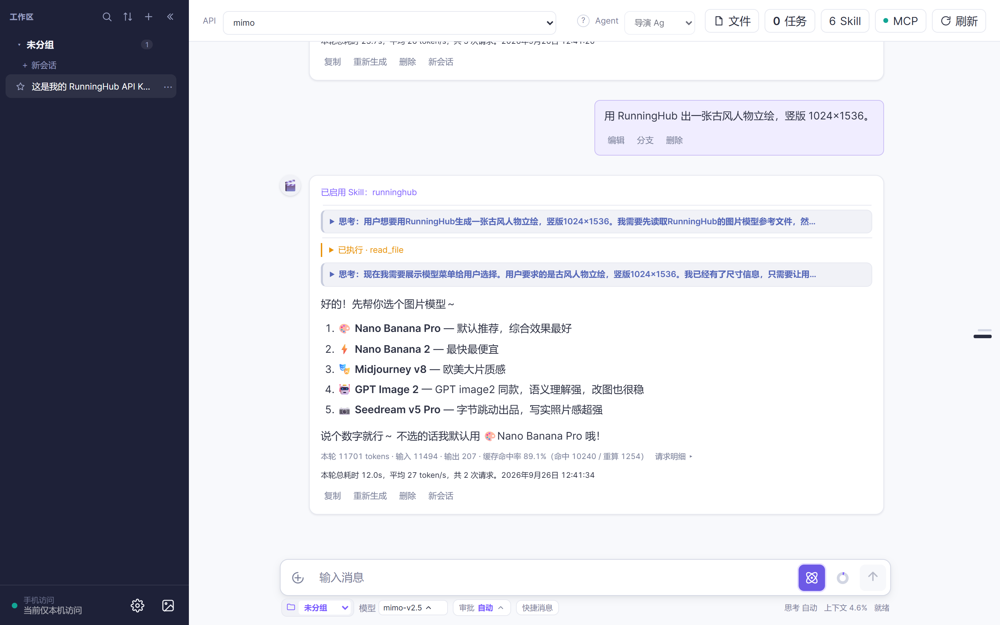

# 3 分钟上手：用 RunningHub 云端出图出片（不用本地显卡）

> 目标：家里没装 ComfyUI、或者显卡不够用，也能出图出视频——**算力在云上**。
> 前提：**已经按教程 1 配好一个在线 API**（没配先看 [教程 1 · 第一次对话](../tutorial-01-first-chat/README.md)）。
> 你只需要：**切到导演 Agent**、**打 `/` 引用技能**、**说清要什么**。

---

## 第 1 步：切到导演 Agent，再用 `/` 引用 RunningHub（约 30 秒）

1. 在顶栏 Agent 下拉里选 **「导演 Agent」🎬**。
2. 在输入框打一个 **`/`**，会弹出已装 Skill 的列表——选 **`runninghub`**：



打 `/` 是「**本轮临时借用某个技能**」的标准做法，任何已装技能都能这样呼出来（教程 7 会细讲）。

> RunningHub 这套技能是**出厂自带**的，不用你先去装。`/` 只是告诉 AI「这一轮按这个技能的说明来干活」。

## 第 2 步：拿到 Key，交给 AI 保管（约 1 分钟）

RunningHub 是云端服务，得先有一个自己的 Key：

1. 去 [runninghub.cn](https://www.runninghub.cn) 注册账号（**首次使用需要充值**，按量计费）。
2. 在站内创建自己的 **API Key**。
3. **直接把 Key 发给 AI**，让它自己验证并保存：

```text
这是我的 RunningHub API Key：xxxxxxxxxxxxxxxx，帮我测试能不能用，然后存下来。
```



> 你也可以自己设系统环境变量 `RUNNINGHUB_API_KEY`，效果一样。
> Key 存在你本机的配置里；除了调用 RunningHub 自己，不会发给别处。

## 第 3 步：说清楚你要什么（约 30 秒）

云端按次计费，所以**先说清楚再提交**最省钱。至少说三件事：

| 要素 | 例子 |
|---|---|
| **要什么** | 一张古风人物立绘 / 一段 5 秒的产品展示视频 |
| **规格** | 竖版 1024×1536 / 横版 / 视频 5 秒 |
| **参考**（可选） | 直接拖一张图进输入框当参考 |

例如：

```text
用 RunningHub 出一张古风人物立绘，竖版 1024×1536，参考我拖进去的这张图。
```



AI 会把参数整理好、提交到云端，**在云端排队**。

## 第 4 步：等云端跑完，产物自动回来（时间看排队）

提交之后是在**云端排队 + 生成**，不在你电脑上跑，所以你可以去干别的（Cat Chat 窗口留着就行）。

- 产物**直接挂回消息里**，点开看大图 / 播放；
- 真实文件落盘在 `data\generated` 目录；
- 长任务挂后台跑，点顶栏的 **「任务」** 看进度、也能停：


> 排队时长取决于云端负载，高峰期可能从几分钟到十几分钟。

---

## 常见问题

**Q：提示没有 Key / 认证失败？**
A：先去 runninghub.cn 拿 Key，然后把 Key 发给 AI 让它存下来（第 2 步）。Key 失效了就重新生成一个。

**Q：提示余额不足？**
A：RunningHub 按量计费，去站内充值即可。

**Q：排队很久？**
A：云端负载决定的，高峰期慢。建议先用一张小图把参数试对，满意了再批量出。

**Q：我自己的 ComfyUI 工作流能用吗？**
A：能。RunningHub 支持把你自己的工作流挂到云端跑，需要先在站内拿到它的 **webappId**，再告诉 AI。技能说明里有这条路径，让 AI 带你走一遍就行。

**Q：本地 ComfyUI 和这个怎么选？**
A：有显卡、想省钱的用 **教程 2**（本地 ComfyUI）；没显卡、想省事的用这篇。

---

## 下一步

- 想把一段剧本**批量变成视频**：看 **教程 4 · 3 分钟出一集短剧**
- 想让 AI 帮你**把一句话改成专业提示词**：看 **教程 5 · 3 分钟改出一条好提示词**
