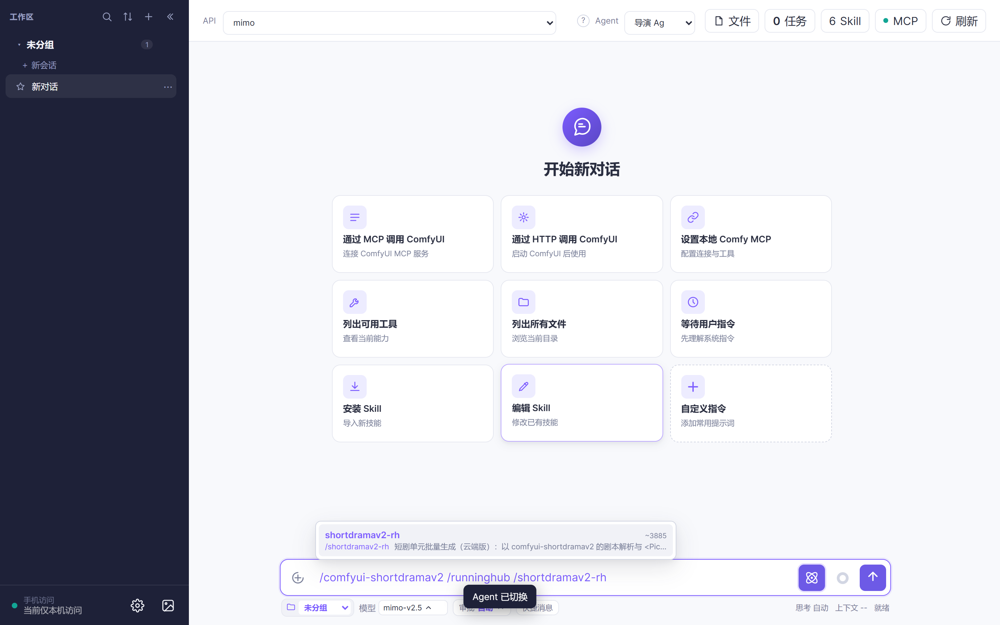
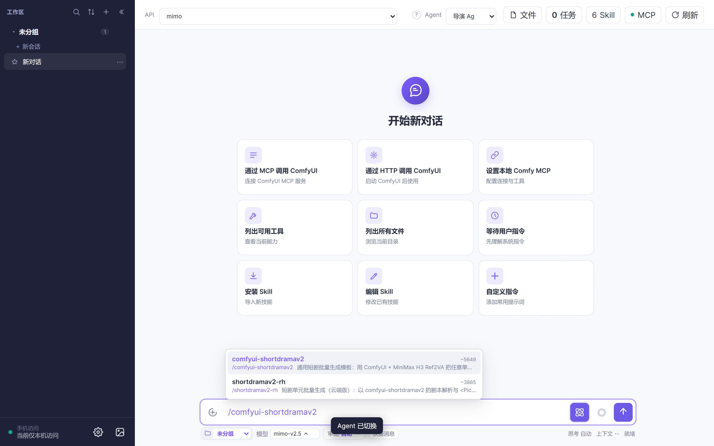
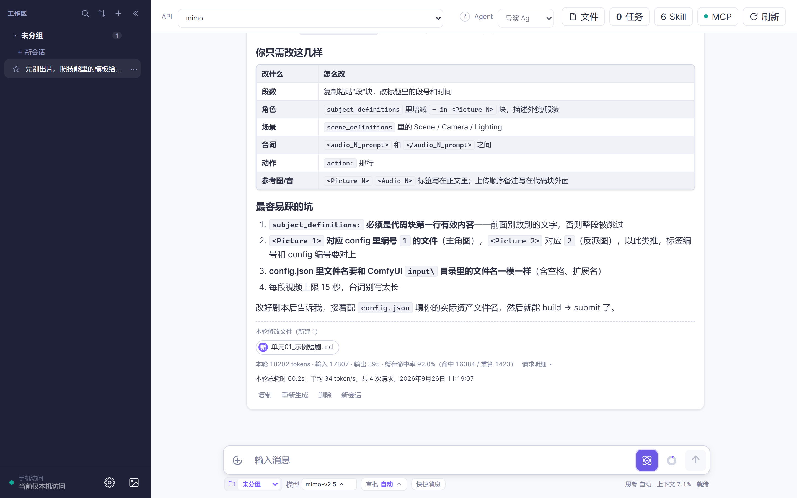
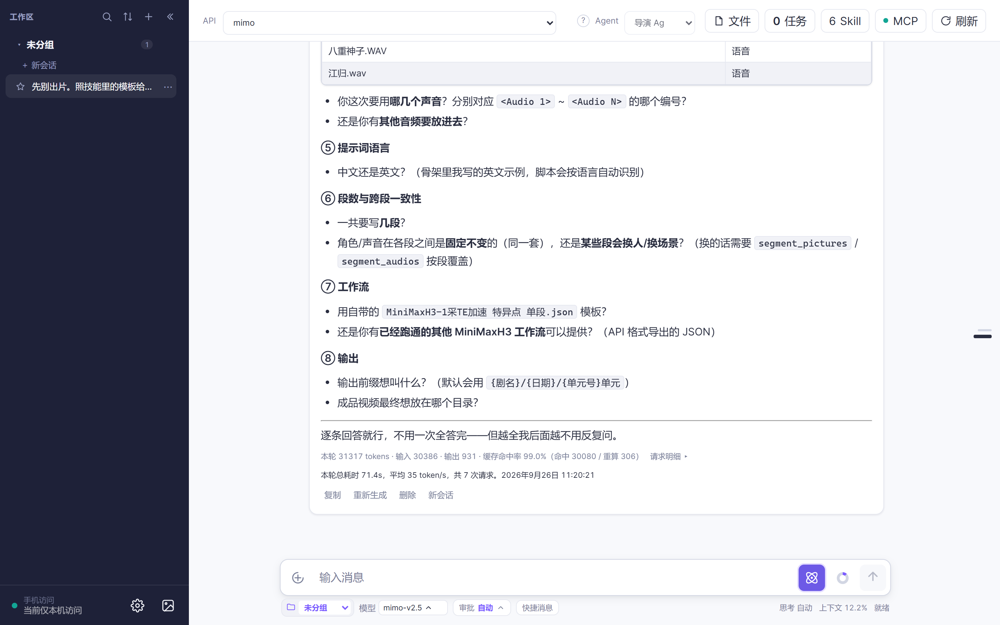

# 3 分钟出一集短剧：把剧本变成一段段 15 秒视频

> 目标：跑通「一个剧本 → 一段段 15 秒视频」这条流水线。
> 前提**二选一先跑通**：
> - 有显卡：按 [教程 2 · 本地 ComfyUI](../tutorial-02-comfyui/README.md) 把 ComfyUI 跑起来
> - 没显卡：按 [教程 3 · 云端 RunningHub](../tutorial-03-runninghub/README.md) 把 Key 配好
>
> 外加：**教程 1 的 API 已配好**。

---

## 第 1 步：切导演 Agent，`/` 选一个短剧技能（约 30 秒）

1. 顶栏 Agent 下拉选 **「导演 Agent」🎬**：



2. 输入框打 **`/`**，按你走的路线选一个：

| 你的路线 | 选这个技能 |
|---|---|
| 本地 ComfyUI（教程 2） | `comfyui-shortdramav2` |
| 云端 RunningHub（教程 3） | `shortdramav2-rh` |



> 两个技能**剧本格式完全一样**，只是一个在你电脑上跑、一个在云端跑。先按教程 2 或教程 3 跑通一条，再回来做这个。

## 第 2 步：给它一个剧本（约 1 分钟）

两种来源都行：

- **自己写好**（推荐，格式要求见下）；
- **让 AI 先写一版**：给一句创意，让它按格式产出，你再改。

剧本是一个 markdown 文件，**每段一条英文提示词 + 参考标签**，骨架长这样：

```text
## 第 1 段 雨夜相遇（0–15 秒）

**H3 提示词**

（这里是一个 text 代码块，正文从 subject_definitions: 开始）
```



**三条格式要求**（不合规的段会被直接跳过，这是最常见的卡点）：

1. 提示词正文必须**从 `subject_definitions:` 这一行开始**；
2. **`<Picture N>` / `<Audio N>` 标签要写在提示词正文里**——只写在上传前缀里，素材不会挂载；
3. 每段标题写成 `## 第N段 …（0–15 秒）` 这种能被识别的形式。

> 不用从零背格式：技能里带了可直接用的模板剧本，让 AI「照技能里的模板给我搭一个骨架」更快。

## 第 3 步：备好角色图与声音（约 30 秒）

跨段保持角色一致，靠的就是这些**参考资产**：

- 角色图（`<Picture N>` 对应的形象）
- 声音参考（`<Audio N>` 对应的音色）

按技能要求放到指定位置，或者直接拖进输入框——AI 会告诉你放哪。

## 第 4 步：一步步确认，然后批量提交

短剧技能的设计是**先问后做**，它大概会依次问你：

1. 用哪个单元、哪几段？
2. 提示词有中英两版时，提交哪一版？
3. 参考资产齐了吗、映射对不对？



确认完才开始批量提交。**中途想改**就直接说，它会停下重来。

## 第 5 步：看进度，拿成品

批量出片在后台跑。点顶栏 **「任务」** 看进度：


成品**挂回消息里**直接播放；真实文件落盘在 `data\generated`：


---

## 常见问题

**Q：它说找不到 `subject_definitions:`？**
A：这段的提示词格式不对，被跳过了。检查代码块里是不是**从 `subject_definitions:` 开始**的。

**Q：出片里角色长得不一样？**
A：参考图/音轨没挂上。检查 `<Picture N>` / `<Audio N>` 是不是**写在了提示词正文里**（写在上传前缀里不算）。

**Q：太慢，想停？**
A：任务面板里停，或者直接让 AI 停。

**Q：想改某一段的台词？**
A：改剧本文件里那一段的提示词，然后让它只重跑那几段。

**Q：本地和云端能混用吗？**
A：同一集建议走同一条路（同一套资产的映射才稳定）。换路线时重新按 `/` 选另一个技能即可。

---

## 下一步

- 觉得提示词不够专业：看 **教程 5 · 3 分钟改出一条好提示词**
- 想给 Agent 装个新技能：看 **教程 7 · 3 分钟给 Cat Chat 装个新技能**
