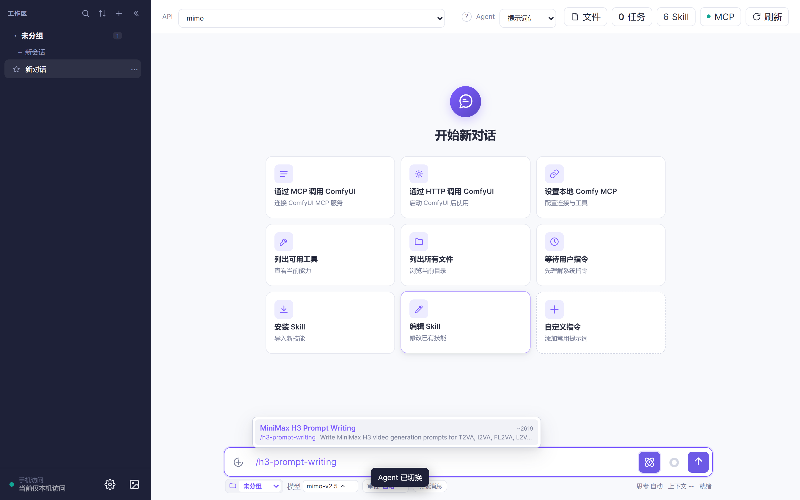
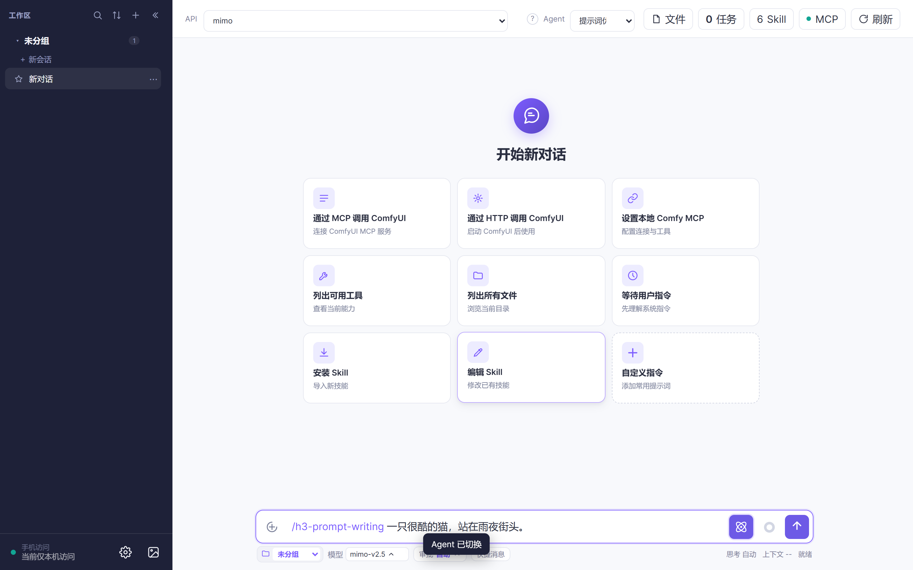
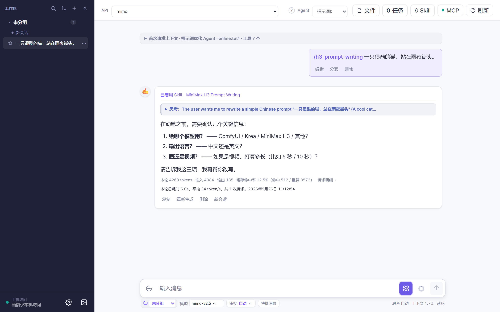
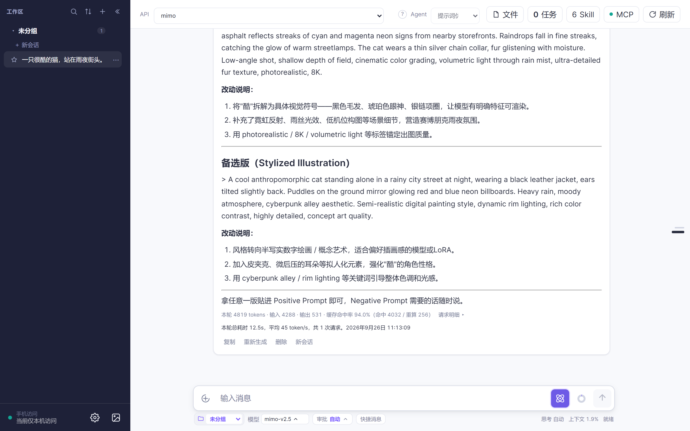

# 3 分钟改出一条好提示词：把大白话变成能直接用的提示词

> 目标：把「一只很酷的猫」这种大白话，变成能直接粘进模型里的专业提示词。
> 前提：**教程 1 的 API 已配好**（[教程 1 · 第一次对话](../tutorial-01-first-chat/README.md)）。
> 这一篇**不需要任何外部账号**，纯文字就能跑。

---

## 第 1 步：切到「提示词优化 Agent」（约 15 秒）

顶栏 Agent 下拉里选 **「提示词优化 Agent」✍️**：



它自带一套 H3 提示词规则库，所以**你不用先教它规矩**——张口就是结构化的写法。

> 这个 Agent 的工具集很小：读文件、读 PDF、看图，加上写稿和改稿。
> **它不能跑命令、不能联网、也不能出图**——只负责把话说漂亮。

## 第 2 步：丢给它一句话，或一张图（约 20 秒）

两种都行：

- 一句大白话，比如「一只很酷的猫」；
- **直接拖一张参考图进去**，让它照着图里的风格、构图来写。

```text
一只很酷的猫，站在雨夜街头。
```



## 第 3 步：答它三个问题（约 30 秒）

它会**先问清楚再动笔**（这比直接甩给你一版更省事）：

| 问题 | 你要回答 |
|---|---|
| 给**哪个模型**用？ | ComfyUI 工作流 / Krea / MiniMax H3 / 其他 |
| 要**中文还是英文**？ | 多数出图模型吃英文更稳 |
| 出**图**还是出**视频**？ | 决定要不要写运镜、时长这类字段 |



> 答不上来也没关系：说一句「你按常见的来」，它自己挑一套主流写法，并告诉你它选了什么。

## 第 4 步：拿到「主打一版 + 备选一版 + 三行改动说明」

它的输出是固定的两段：

1. **优化后的提示词正文**（主打一版）；
2. **备选一版**（换个思路，比如更写实 / 更风格化）；
3. **三行以内的改动说明**——告诉你它加了什么、为什么加。



**不满意就接着提**，比如「太写实了，我想要动漫感」「把背景换成雪夜」。它会基于上一版继续改，不用你重新描述一遍。

## 第 5 步：拿去用

- **复制粘贴**：直接粘进 ComfyUI 的提示词框（或任何模型界面）；
- **交给导演 Agent**：切回导演 Agent，说一句「照这个提示词出图」；
- **存起来**：满意的版本丢进你的剧本/素材文件，下次直接复用。

---

## 常见问题

**Q：到底给中文还是英文？**
A：它会问你。经验上出图模型对英文更稳，中文模型按它自己的文档来。

**Q：参考图怎么给？**
A：直接拖进输入框当附件。它能先看图再写，写出来的描述会贴合图里的构图与色调。

**Q：改得不像我要的怎么办？**
A：别重开，**把不满意的点说回去**（「头发再短点」「光再硬点」）。它会基于当前这版微调。

**Q：它能直接出图吗？**
A：不能，它只管**写提示词**。出图请用 **教程 2**（本地 ComfyUI）或 **教程 3**（云端 RunningHub）。

---

## 下一步

- 拿到好提示词去出图：**教程 2** 或 **教程 3**
- 想批量出片：**教程 4 · 3 分钟出一集短剧**
