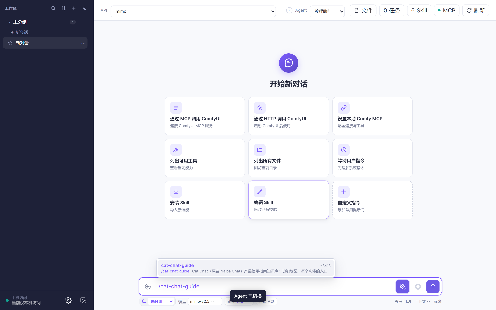
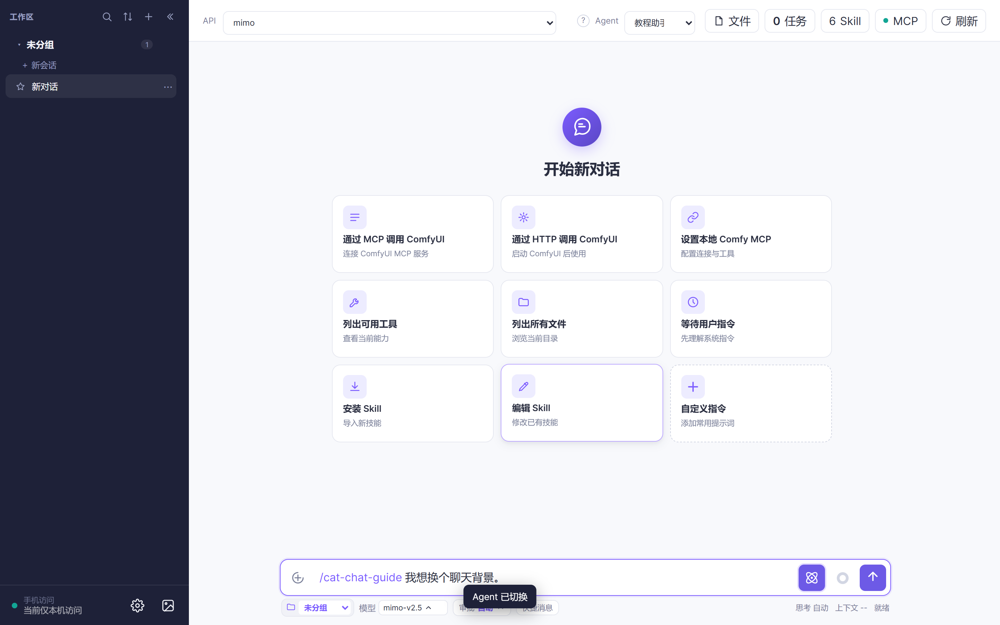
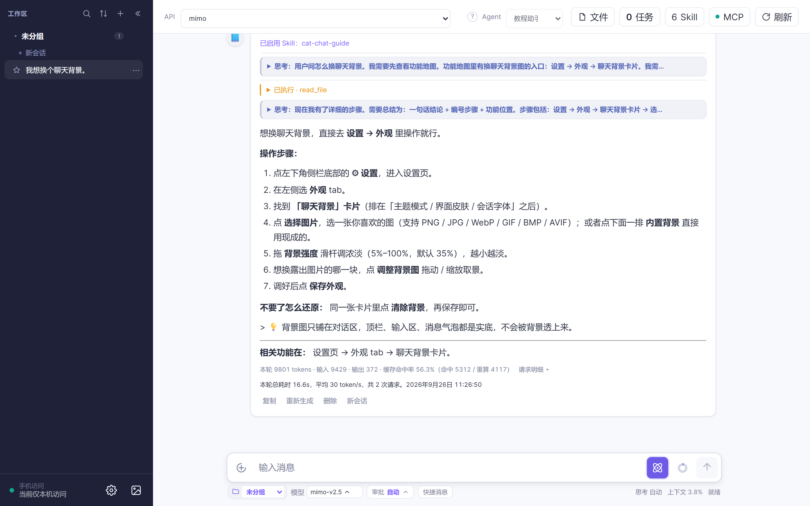
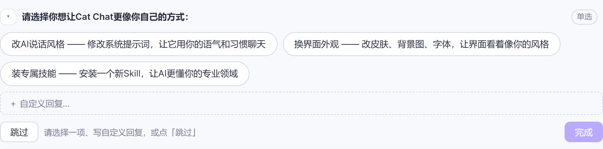
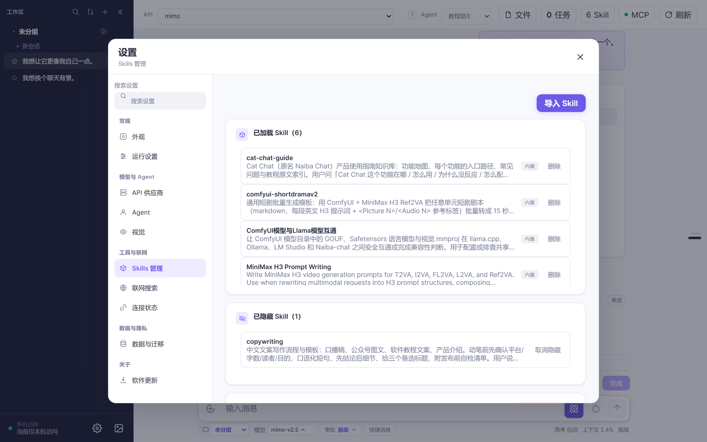

# 3 分钟认识教程助手：不会用，就问下拉里的第一位

> 目标：记住「不会就问第一位」，并且知道它凭什么答得准。
> 前提：**教程 1 的 API 已配好**（[教程 1 · 第一次对话](../tutorial-01-first-chat/README.md)）。
> 这是本系列的**收尾篇**，末尾附全套 8 篇速查表。

---

## 第 1 步：它在哪？Agent 下拉的第一位（约 15 秒）

点开顶栏的 Agent 下拉，**排在最上面的就是「教程助手 Agent」📘**：



**本系列的每一篇教程，都告诉你「往下拉第一位」**——因为它的位置是固定的，不会因为你
编辑过别的 Agent 而变。

## 第 2 步：怎么问？直接说「我想……」（约 15 秒）

不用管功能叫什么名字，也不用把话说完整：

```text
我想换个聊天背景。
```



**描述不清也没关系**——这正是它和普通对话最大的区别。

## 第 3 步：它怎么答？固定三段式（约 40 秒）

它的回答格式是钉死的，每次都长这样：

1. **一句话结论**——先告诉你行不行、在哪；
2. **编号的点击步骤**——精确到按钮名和页面名，比如「左下角 ⚙ 设置 → API 供应商 → 添加 API」；
3. **末尾一句**——告诉你这个功能在软件的哪个页面。



> 因为它**绝不编造按钮名字**：遇到拿不准的细节，它会先翻自己的工作手册再回答。
> 所以它偶尔会说「这一步我需要确认一下」，那是它在查，不是在敷衍。

## 第 4 步：它会反过来问你（约 15 秒）

如果你说得太含糊，它不会瞎猜，而是给你 **2–3 个「你是不是想……」**让你挑：



挑一个就行。这一来一回，比你自己琢磨怎么描述快得多。

## 第 5 步：它的底气从哪来（约 20 秒）

它随身带着一份内置 Skill——**「Cat Chat 使用指南」**（`cat-chat-guide`）：



这份手册里装的是：**手册要点 + 本系列每一篇教程的原文**。

> 也就是说：**你正在看的这些教程，就是它的知识库。**
> 教程随版本更新，它知道的东西也跟着变厚——**升级到新版本，它就知道新功能**。
>
> 顺带一提：这就是为什么它**不靠网上搜**。它答的是「Cat Chat 这个软件的按钮叫什么」，
> 网上搜不到，去搜反而容易拿别的软件的按钮名糊弄你。翻本机文档才靠谱。

---

## 常见问题

**Q：它和「全能 Agent」有什么区别？**
A：三处不同。**① 只读**：它不改你的文件、不跑命令，问它最放心；**② 只答软件用法**：写文案、出图找别的 Agent；**③ 答法固定**：结论 + 编号步骤 + 页面位置，从不长篇大论。

**Q：它答错了怎么办？**
A：接着追问，把具体位置说给它（「我点的是设置里的 API 供应商，没有『添加 API』这个按钮」）。**软件长得和教程不一样时，一律以软件为准**，然后把这事反馈给我们。

**Q：为什么不直接用搜索引擎？**
A：它要答的是「这个按钮在哪」这种**本机事实**。搜索引擎搜不到 Cat Chat 的内部按钮名，反而会给出别的软件的做法——那就成了编造。

---

## 全套 8 篇速查表

| 序 | 教程 | 主角 | 什么时候看 |
|---|---|---|---|
| 1 | [3 分钟第一次对话](../tutorial-01-first-chat/README.md) | 全能 Agent 🐱 | **装完先看这篇**：配 API、认界面、发第一句 |
| 2 | [3 分钟 ComfyUI 出图](../tutorial-02-comfyui/README.md) | 导演 Agent 🎬 | 本机有显卡，想批量出图 |
| 3 | [3 分钟用 RunningHub 云端出图](../tutorial-03-runninghub/README.md) | 导演 Agent 🎬 | 没显卡 / 不想装 ComfyUI |
| 4 | [3 分钟出一集短剧](../tutorial-04-shortdrama/README.md) | 导演 Agent 🎬 + 短剧 Skill | 想把剧本变成一段段 15 秒视频 |
| 5 | [3 分钟改出一条好提示词](../tutorial-05-prompt/README.md) | 提示词优化 Agent ✍️ | 脑子里只有一句大白话 |
| 6 | [3 分钟让 AI 写个小工具](../tutorial-06-coding/README.md) | 编程助手 Agent 💻 | 不会写代码，但想让电脑替你干活 |
| 7 | [3 分钟给 Cat Chat 装个新技能](../tutorial-07-skill/README.md) | Skill 助手 Agent 🧩 | 想装 / 换 / 固定 Skill |
| 8 | 3 分钟认识教程助手（本篇） | 教程助手 Agent 📘 | **任何时候卡住了，回来问它** |

**一句话记住全部**：**卡住就问下拉第一位** 📘
